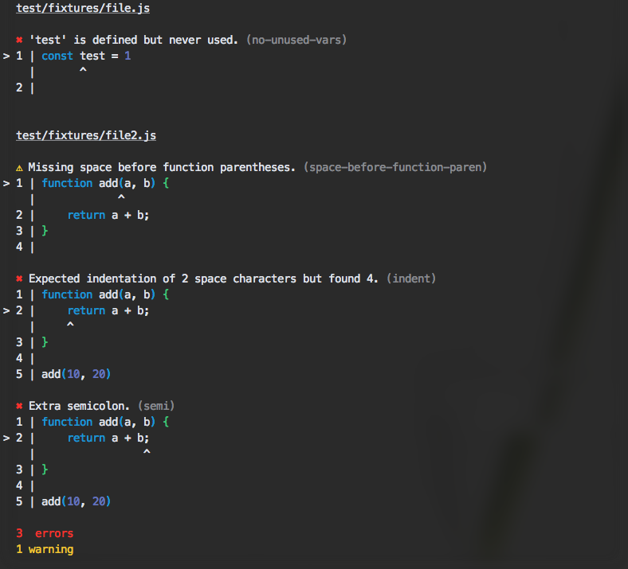

# eslint-codeframe-formatter

[](https://github.com/feross/standard)
[](https://travis-ci.org/adriantoine/eslint-codeframe-formatter)

[ESLint](http://eslint.org/) formatter using [babel-code-frame](https://www.npmjs.com/package/babel-code-frame) to show the piece of code where the errors and warnings are.




## Install

```console
$ npm install --save-dev eslint-codeframe-formatter
```

## Usage

```
$ eslint --format=node_modules/eslint-codeframe-formatter file.js
```

## License

MIT © [Adrien Antoine](https://adriantoine.com)
